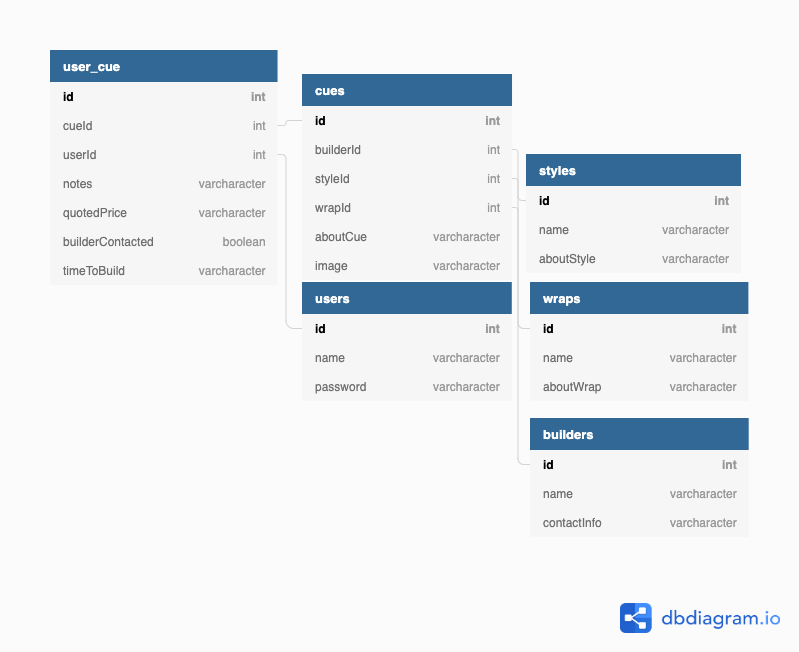

# Welcome to: That's My Cue

## Available Scripts

In the project directory, you can run:

### `npm start`

Runs the app in the development mode. 
Open [http://localhost:3000](http://localhost:3000) to view it in the browser.

## What is That's My Cue?
That's My Cue is an app for people who are interested in purchasing a new custom pool cue.
This multi user app replaces hours of searching websites and FaceBook pages to find information about different styles of pool cues and the people who build them.
Users can login/register in the same step - logic is built in to not allow a user to register more than once
\
There are 2 primary sections to the app:
- Cues which allows a user to see all available cues and the details pertaining to them
- User_Cues which allows a user to see the cues they have selected from all cues and any notes they have chosen to add including whether they have contacted the builder or not
Users should log out once they are done

## ERD

## Technologies used
React
React Bootstrap
Moqups
DbDiagram
CSS

# Enjoy!
